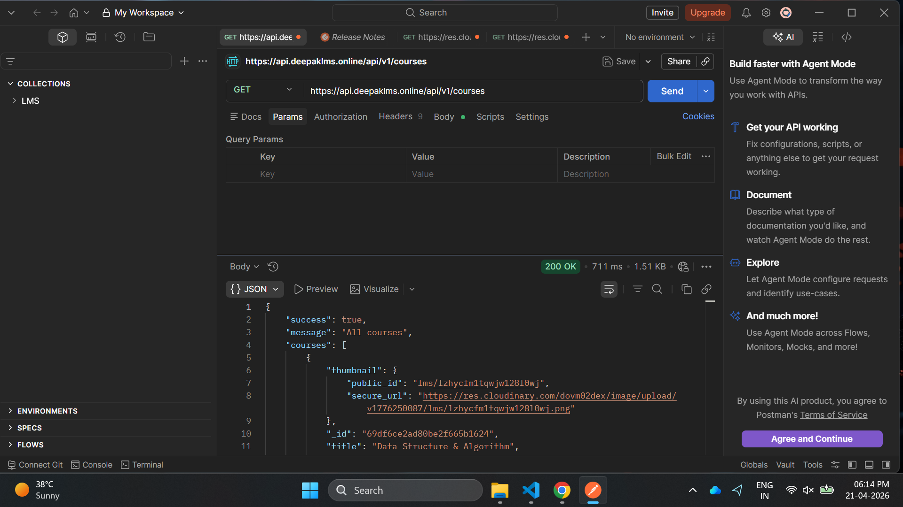
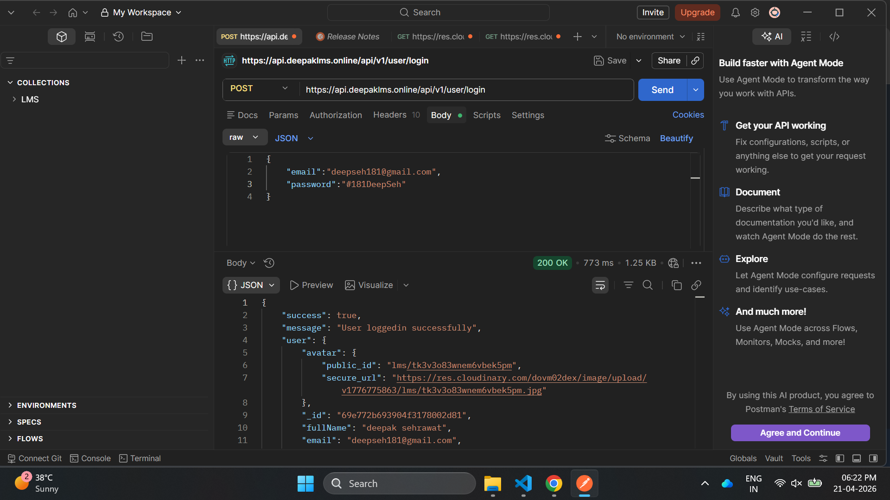
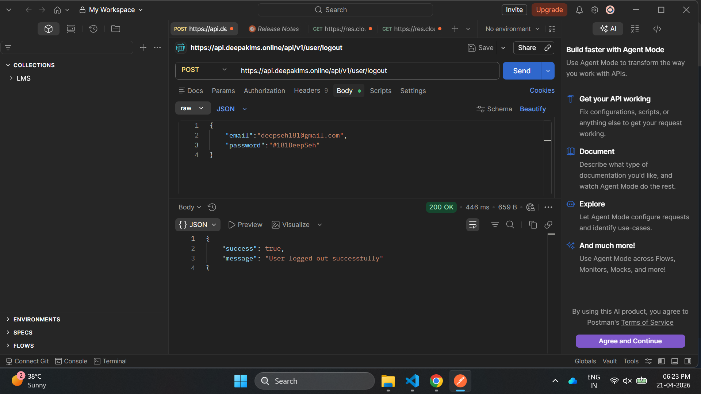

# 🚀 LMS Backend

## 📌 Overview

This is the backend for a Learning Management System (LMS) built using Node.js and Express. It provides secure APIs for authentication, course management, and data handling, supporting a scalable learning platform.

---

## 🚀 Features

* 🔐 User Authentication (Login / Signup)
* 📚 Course Management
* 👨‍🏫 Instructor & Student Roles
* 📡 RESTful API Integration
* ⚡ Scalable and modular backend structure

---

## 🛠 Tech Stack

* Node.js
* Express.js
* MongoDB
* JWT Authentication
* cloudinary
* brevo-api
* razorpay-Payment-Gateway
* bcrypt-password-hashing

---

## 📂 Project Structure

```
backend/
├── controllers/
├── models/
├── routes/
├── middleware/
├── config/
├── server.js / index.js
```

---

## ⚙️ Installation & Setup

### 1️⃣ Clone the repository

```bash
git clone https://github.com/Deepak7200/LMS-Backend.git
cd LMS-Backend
```

### 2️⃣ Install dependencies

```bash
npm install
```

### 3️⃣ Setup environment variables

Create a `.env` file in root:

```
NODE_ENV = development

PORT = 5000

MONGO_URL = mongodb://127.0.0.1:27017/lms

JWT_SECRET = <YOUR_LONG_JWT_SECRET>
JWT_EXPIRY = <JWT_EXPIRY>

CLOUDINARY_CLOUD_NAME = <YOUR_CLOUDINARY_CLOUD_NAME>
CLOUDINARY_API_KEY = <YOUR_CLOUDINARY_API_KEY>
CLOUDINARY_API_SECRET = <YOUR_CLOUDINARY_API_SECRET>

SMTP_HOST = <YOUR_SMTP_HOST>
SMTP_PORT = <YOUR_SMTP_POST>
SMTP_USERNAME = <YOUR_SMTP_USERNAME>
SMTP_PASSWORD = <YOUR_SMTP_PASSWORD>
SMTP_FROM_EMAIL = <YOUR_SMTP_FROM_EMAIL>

BREVO_API_KEY= <BREVO_API_KEY>
BREVO_SENDER_EMAIL= <BREVO_SENDER_EMAIL>

RAZORPAY_KEY_ID = <YOUR_RAZORPAY_KEY>
RAZORPAY_SECRET = <YOUR_RAZORPAY_SECRET>
RAZORPAY_PLAN_ID = <YOUR_RAZORPAY_PLAN_ID>

FRONTEND_URL = <YOUR_FRONTEND_WEBSITE_URL>

CONTACT_US_EMAIL = <YOUR_CONTACT_US_EMAIL>
```

### 4️⃣ Run the server

```bash
npm start
```

---

## 🔗 API Endpoints (Basic)

```
GET    /api/v1/courses        -> Get all courses
POST   /api/v1/user/login     -> Login user
GET    /api/v1/user/me        -> Get user data
POST   /api/v1/user/logout    -> Logout user
```

---

## 🌐 Live Demo

[api.deepaklms.online/ping](https://api.deepaklms.online/)

---

## 📸 Screenshots

### Get all courses


### Login User


### Get User Profile


### Logout User


---

## 🤝 Contributing

Contributions are welcome! Feel free to fork the repo and submit a pull request.

---

## 📄 License

This project is open-source and available under the MIT License.

---

## 👨‍💻 Author

Deepak Singh Sehrawat
